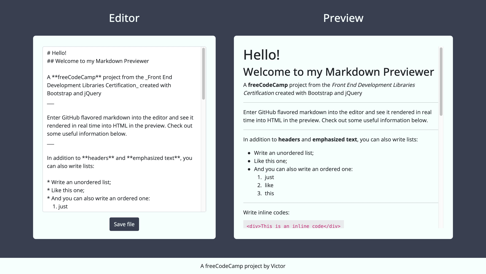

# Markdown Previewer
https://victordrumond.github.io/markdown-previewer/

## Technologies
`HTML` `CSS` `JavaScript` `Bootstrap` `jQuery`

## Description
* A responsive Markdown previewer build with HTML, CSS (with Bootstrap) & JavaScript (with jQuery).
* Enter GitHub Flavored Markdown and see it rendered in real time in the preview.
* A [project](https://www.freecodecamp.org/learn/front-end-development-libraries/front-end-development-libraries-projects/build-a-markdown-previewer) from freeCodeCamp's Front End Development Libraries Certification.
* Extra feature: download button generates .md file from the content typed into the editor.
* Markdown parser and compiler: [Marked.js](https://marked.js.org).

## Credits
* Quick Markdown guide from [Cuong Giang](https://gist.github.com/cuonggt/9b7d08a597b167299f0d).
* Detailed Markdown guide from [Matt Cone](https://www.markdownguide.org/getting-started/).

## Screenshot
